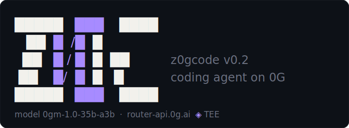

# z0gcode

<p align="center">
  
</p>
<p align="center"><sub>A barred zero: the circle is the <code>0</code> of 0G, the violet slash the <code>z</code> of z0g.</sub></p>

<p align="center">
  <b>A terminal coding agent whose brain runs on <a href="https://0g.ai">0G Compute</a>.</b><br>
  Private, verifiable AI for developers, powered by 0G's own coding model, and an expert at building on the 0G stack.
</p>

<p align="center">
  <a href="https://www.npmjs.com/package/z0gcode"></a>
  
  
  
  
  
  
</p>

Built by **Andrei & Claude** for the 0G track at ETHGlobal Lisbon (Track 2: Infrastructure & Tooling).

<p align="center">
  
</p>

## Why z0gcode

Most coding agents ship your code and prompts to OpenAI or Anthropic. z0gcode sends them to **0G's decentralized, TEE-backed inference** instead, and three things follow, each carrying real weight:

1. **Its brain runs on 0G.** Every reasoning step and tool call is served by the [0G Compute Router](https://docs.0g.ai/developer-hub/building-on-0g/compute-network/router/overview), private and verifiable (TEE), on 0G's own `0gm-1.0-35b-a3b` coding model. No OpenAI or Anthropic key, no data leaving to Big Tech, and open models at a fraction of the cost (compare with `z0g models`).
2. **It is an expert at building on 0G.** It ships with bundled 0G skills (chain, compute, storage, network, security, testing), so it writes correct 0G code including the non-obvious bits: for a 0G Chain deploy it sets, unprompted, the required `evmVersion: "cancun"`, Solidity `0.8.24`, and `chainId 16661` ([proof](docs/PROOF.md)).
3. **It can prove which model wrote your code.** Because 0G inference is verifiable, `z0g attest` records a manifest binding each file change (before and after hash) to the exact 0G model, response id, and the on-chain **0G provider node address** that served it (captured from 0G's `x_0g_trace`). A closed-provider CLI cannot do this.

The agent loop, tools, and CLI are original and dependency-light (one runtime dep). z0gcode is inspired by OpenCode and Claude Code; see [NOTICE](NOTICE).

## Quickstart

```bash
npm install -g z0gcode                 # or: npm i -g z0gcode --omit=optional (lean core, no on-chain deps)
export ZOG_API_KEY=<your 0G Router key from https://pc.0g.ai>
# or put ZOG_API_KEY=... in a project .env (any parent dir works too), or in
# ~/.z0gcode/.env to use `z0g` from anywhere (see .env.example for all options)

z0g doctor                             # check key, connectivity, model
z0g "add a /health endpoint to server.js and test it"
```

The optional on-chain features (`share`, `mint`, `deploy`, `upload`) pull `ethers` and the 0G Storage SDK; `--omit=optional` skips them for a lean, one-runtime-dependency install and adds them later with `npm i -g ethers @0gfoundation/0g-storage-ts-sdk`.

**From source:**

```bash
git clone https://github.com/mr-reb00t/z0gcode && cd z0gcode
npm install && npm link                # or run directly with: node bin/z0g.mjs
```

## Usage

```bash
z0g "add a /health endpoint to server.js and test it"   # one-shot task
z0g --auto "scaffold a Fastify app and run it"           # auto mode: runs commands without asking (else it asks you first)
z0g goal --auto "make the failing tests pass"            # iterate until a verify command passes
z0g --continue "now add input validation"                # resume the most recent chat
z0g --resume                                             # pick a chat to resume (arrow-key picker)
z0g                                                      # interactive session (picks a chat if the project has any)
z0g "add a /health endpoint" --json                      # headless: emit the run result as JSON (for CI/scripts)
z0g models                                               # rich table of 0G models (add --json)
z0g skills                                               # list user/project skills (enable|disable)
z0g doctor                                               # check key, connectivity, model
z0g attest                                               # show which 0G model wrote which change
z0g image "a flat blue rocket icon" rocket.png           # generate an image on 0G (z-image-turbo)
z0g transcribe memo.mp3                                  # transcribe audio on 0G (whisper-large-v3)
z0g serve --mcp                                          # expose z0gcode's 0G tools over MCP
```

**In the REPL**, type `/` then **Tab** to autocomplete slash commands: `/chats`, `/new`, `/rename`, `/init`, `/goal`, `/mode`, `/model`, `/effort`, `/subagents`, `/onchain`, `/skills`, `/attest`, `/share`, `/pull`, `/mint`, `/plan`, `/verify`, `/compact`, `/clear`, `/help`, `/exit`. `/chats` opens an arrow-key session picker (type to search, `ctrl-r` rename, `ctrl-x` delete); `/new [title]` starts a chat and `/rename <title>` renames the current one. `/mode ask|auto|plan` switches the permission mode; `/model` opens the model picker (saved to `~/.z0gcode/settings.json`); `/effort low|medium|high` (or `default`) tunes reasoning depth vs speed and cost; `/subagents on|off` toggles parallel subagents; `/onchain on|off` toggles gas-spending on-chain actions (off by default); `/escalate on|off` toggles switching to a stronger model on repeated failures; `/skills` lists and toggles your skills; `/share [anchor]` exports the session (encrypted) to 0G Storage (and anchors it on 0G Chain), and `/pull <root>` fetches, verifies, and decrypts one back. A short intro animation and a "thinking on 0G" indicator play on a color TTY; set `Z0G_NO_ANIM=1` to disable. Each turn is separated by a divider carrying a running session token and cost counter.

**Options:** `--auto`, `--onchain`, `--continue`, `--resume`, `--new`, `--model <id>`, `--effort low|medium|high`, `--no-subagents`, `--verify "<cmd>"`, `--auto-verify`, `--max-steps <n>`, `--cwd <dir>`, and `--json` (headless: with a task it emits the run result, files changed, and provenance as JSON; with `models` it emits the catalog).

## Features

**The agent**
- Agentic loop with tools: `search_files` (regex + glob), `read_file`, `write_file`, `edit_file`, `list_dir`, `run_bash` (gated by the permission mode below), `update_plan`, `read_skill`, and `web_search` / `web_fetch`.
- **Web tools**: `web_search` (top results from DuckDuckGo, no API key) and `web_fetch` (read a URL as text) let the agent look up current docs and APIs instead of guessing; gated by the permission mode, and available in `plan` mode for research.
- **Permission modes** (`/mode`, like Claude Code): **ask** (default) prompts before each shell command and on-chain action (`y` / `n` / `a` = always), and "always" choices are remembered in `~/.z0gcode/settings.json` so it never asks again for that program; read-only commands (`ls`, `cat`, `git status`, `grep`…) run without asking. **auto** (`--auto`) runs without asking; **plan** is read-only, the agent explores and proposes a plan and touches nothing until you switch to ask or auto.
- **Interrupt and compact**: `Ctrl+C` stops the current turn and returns you to the prompt (it does not kill z0g); `/compact` summarizes the conversation to shrink context and cost when it grows.
- Colored diffs for every change, an inference HUD (tokens, answering model, `0G Compute (TEE)`), and a visible planning checklist on multi-step tasks.
- Streaming answers rendered as terminal markdown (bold, headings, lists, tables, inline code, and syntax-highlighted code blocks for JS/TS, Python, Solidity, Go, Rust, shell, JSON, and more); piped output stays raw and greppable.
- Multiple chats per project, each isolating its own history, plan, and provenance under `.z0g/sessions/`. On open, an arrow-key picker (with search, rename, delete) resumes a chat; `--continue` resumes the most recent, `--resume` shows the picker, `/chats` switches mid-session. Plus a goal loop (`z0g goal` re-runs until a verify command passes) and auto-verify.
- **Project context**: `AGENTS.md` (and `.z0g/context.md`) are auto-loaded into the agent's system prompt on every run, so it follows your conventions and uses your real build/test/run commands. `z0g init` (or `/init`) analyzes the repo and writes an accurate `AGENTS.md` for you.
- **Checkpoints and undo**: every file edit is logged with its before/after content per turn, so `z0g undo` (or `/undo`) reverts the last turn's changes (restoring files, deleting ones it created); `z0g checkpoints` lists what you can step back through.
- **Custom commands and hooks**: drop `.z0g/commands/<name>.md` to add a `/<name>` slash command (the file is a prompt template; `$ARGUMENTS` is substituted, optional `description:` frontmatter, Tab-completed and listed by `/commands`). Define lifecycle hooks in `.z0g/hooks.json` (`preRun` / `postRun` shell commands, e.g. run your formatter or tests after each turn); hooks run shell, so they only fire with `--auto`.
- Reliability on a decentralized backend: app-level multi-model fallback, retry and backoff, tool-JSON repair, a loop breaker (on repeated identical calls, or the same tool result with no progress, it first escalates to a stronger model to try to get unstuck and only then hands control back, instead of spinning), and model escalation (when a tool fails repeatedly it moves to a stronger fallback for the rest of the turn; on by default after 3 failures, toggle with `/escalate on|off` or `--no-escalate`).
- **Parallel subagents**: `spawn_subagents` fans out independent, read-only subtasks (review many files, research, audit, map a codebase) as isolated agents running in parallel, capped by `ZOG_MAX_PARALLEL`. The parent synthesizes the results and each subagent's transcript is saved. With 0G's cheap inference, fanning out to many agents costs cents: massively parallel agents at 0G prices. On by default; toggle with `/subagents on|off` or `--no-subagents`.
- **Parallel write subagents**: with `--auto` in a git repo, `spawn_write_subagents` fans out subtasks that WRITE code, each in its own isolated **git worktree**, then merges every diff back into the working tree. Disjoint file sets merge automatically; overlapping edits are reported and skipped (never half-applied), and the merged changes are checkpointed so `z0g undo` reverts them. Verified end-to-end on 0G.

**0G-native**
- `z0g models`: a live table from the Router (price in and out per 1M tokens, context, max output, TEE trust tier, savings vs the official API), grouped 0G-native, verifiable, and open, plus an arrow-key `/model` picker.
- Verifiable provenance with `z0g attest`, and a **private, verifiable session**: `z0g share` (or `/share`) bundles the transcript + provenance, **encrypts it client-side with a key derived from your wallet**, and uploads the ciphertext to **0G Storage**, returning a content root; `z0g share --anchor` writes that hash to **0G Chain**. 0G Storage is public, so encryption is what keeps it private: even with the root on-chain, only your wallet can read it. `z0g pull <root>` (or `/pull`) fetches it back, verifies the content root against 0G Storage, and decrypts it (`--import` loads it as a chat); a different wallet gets authentic bytes it cannot decrypt. Verified on 0G mainnet.
- Native on-chain actions, **off by default and opt-in** (enable with `--onchain`, `/onchain on`, or `ZOG_ONCHAIN=on`, plus a funded `ZOG_WALLET_KEY`): `upload_0g_storage` (publish to 0G Storage, returns a content root) and `deploy_0g_chain` (deploy a compiled contract, returns address + tx). When off, the agent is not offered these tools, so it never spends gas without your say-so. Both verified on 0G mainnet.
- **Session INFT**: `z0g mint` (or `/mint`) turns a session into an ownable on-chain asset. It deploys a minimal ERC-721 (ERC-7857-inspired) once per project and mints a token whose `sessionRoot` records the session's 0G Storage content root, so ownership of a verifiable AI work session lives on 0G Chain. Verified on 0G mainnet (contract + token). Contract source in [contracts/Z0gSession.sol](contracts/Z0gSession.sol).
- Bundled 0G skills the agent reads on demand to write correct 0G code.
- **Media on 0G**: `generate_image` (and `z0g image "<prompt>" [out.png]`) creates PNGs with `z-image-turbo`; `transcribe_audio` (and `z0g transcribe <file>`) turns audio into text with `whisper-large-v3`. Same Router, same key, both private and verifiable on 0G.

**Extensible**
- **User skills** (Claude-Code-style): drop a markdown file with `name` and `description` frontmatter into `~/.z0gcode/skills/<name>.md` (global) or `.z0g/skills/<name>.md` (project, or `<name>/SKILL.md`). z0gcode discovers it, injects the description so the model knows when to use it, and loads the body on demand via `read_skill` (progressive disclosure). Manage with `z0g skills` and `/skills enable|disable <name>`.
- **MCP, both ways**: consume MCP servers (0G or third-party) via `.z0g/mcp.json` (their tools appear as `mcp_<server>__<tool>`), and run `z0g serve --mcp` to expose z0gcode's own 0G tools to other agents (Claude Code, Cursor).

## Running on 0G

- z0gcode points an OpenAI-compatible client at the 0G Compute Router with your 0G key. Default model `0gm-1.0-35b-a3b`; fallbacks `deepseek-v4-pro`, `glm-5.2`, `kimi-k2.7-code`.
- The Router fails over across providers of the same model but does **not** switch models on `503`, so z0gcode adds an app-level multi-model fallback, retry and backoff, tool-JSON repair, and a loop breaker. See [src/client.mjs](src/client.mjs) and [src/agent.mjs](src/agent.mjs).

```bash
npm run verify   # calls the Router directly, confirms tool-calling on the 0G coding models
```

Every on-chain action, storage upload, chain deploy, the encrypted session `share` and its `--anchor`, `pull`, and the session INFT `mint`, was exercised against 0G **mainnet**. See [docs/PROOF.md](docs/PROOF.md) for the recorded runs with on-chain links, and [docs/MODELS.md](docs/MODELS.md) for the model catalog.

## Roadmap

Shipped: streaming with markdown rendering, multiple chat sessions per project (resume picker with search), planning, slash commands, the goal loop and auto-verify, in-agent `deploy_0g_chain` and `upload_0g_storage` (mainnet-verified, opt-in), the private verifiable session (`z0g share`, wallet-encrypted to 0G Storage + `--anchor` on 0G Chain, and `z0g pull` to fetch, verify, and decrypt, mainnet-verified), the session INFT (`z0g mint`, mainnet-verified), parallel subagents, media on 0G (image + transcription), MCP both ways, the model catalog and arrow-key picker, user skills, and a published npm package (`npm i -g z0gcode`).

Next:
- **Share a session, three ways.** Today `z0g share` is a *private* backup: the bundle is encrypted to your wallet, so only you can `pull` it. The plan keeps that and adds two ways to actually hand a session to someone, without ever trusting the storage layer with a key:
  - **Link sharing:** encrypt with a random key that lives only in the share link's fragment, `https://<domain>/s/<root>#k=<key>`. The key is never uploaded and never leaves the `#` fragment, so the ciphertext sitting on public 0G Storage is unreadable without the link. Public in reach, link-gated in access: no link, no read.
  - **Addressed sharing:** `z0g share --to <recipient>`, end-to-end encrypted to a wallet (ECIES), resolved through a key-management layer, a custom domain or name registry, so you share to a handle instead of a raw `0x` address and key discovery and rotation are handled for you.
  - A **custom-domain web viewer** that pulls the ciphertext from 0G Storage and decrypts it in the browser using the fragment key (which, being after the `#`, never reaches the server), so a link recipient reads a session with nothing installed.

  Together these are the on-ramp to full ERC-7857 authorized users.
- Full ERC-7857 (encrypted metadata + oracle transfer) on top of the current session INFT.
- Full TEE-quote verification of the provenance manifest (not just model + response id).
- A shareable starter pack of user skills.

## Development

Offline unit tests run on Node's built-in runner and cover the checkpoints,
context, custom-commands, config, syntax-highlighting, and CLI surface:

```bash
npm test
```

CI runs the suite plus a syntax check on Node 18, 20, and 22 (see [.github/workflows/ci.yml](.github/workflows/ci.yml)).

## Docs

- [docs/ARCHITECTURE.md](docs/ARCHITECTURE.md): how it fits together.
- [docs/MODELS.md](docs/MODELS.md): 0G Router model catalog and model choice.
- [docs/PROOF.md](docs/PROOF.md): recorded, reproducible proof.

## License

MIT. See [LICENSE](LICENSE) and [NOTICE](NOTICE).
